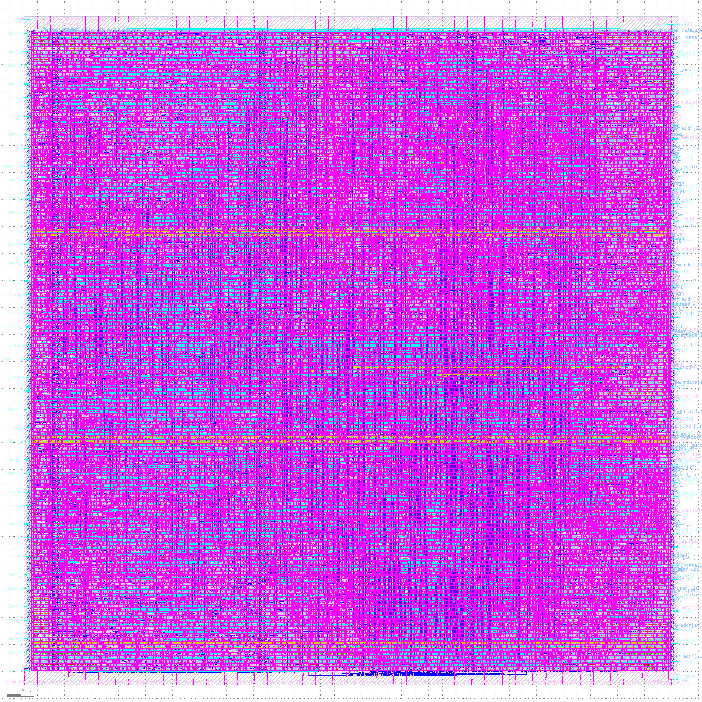

# RV32IM Pipelined Processor — ASIC Implementation

A high-performance, tapeout-ready 5-stage pipelined **RISC-V (RV32IM)** processor microarchitecture implemented in SystemVerilog, timing-closed and physically signed off on the **SkyWater 130nm (`sky130A`)** process node using OpenLane and OpenROAD.

---

## Final Tapeout Layout

<p align="center">
  
  <br>
  <em>Figure 1: Complete physical layout of the RV32IM core on SkyWater 130nm standard cells (0.224 mm² core area, 14,009 cells, DRC/LVS clean).</em>
</p>

---

## Microarchitecture Overview

- **5-Stage Pipeline**: Instruction Fetch (`IF`), Instruction Decode (`ID`), Execute (`EX`), Memory (`MEM`), and Writeback (`WB`).
- **Hazard Handling**:
  - Full forwarding network from `EX/MEM` and `MEM/WB` pipeline registers to ALU operands.
  - Load-use data hazard detection with 1-cycle pipeline bubble insertion.
  - 2-cycle speculative branch penalty with synchronous flush control.
- **Multiply-Divide Unit (MDU)**:
  - **2-Cycle Pipelined Half-Multiplier Tree (`multUnit.sv`)**: Time-multiplexes a compact $33 \times 17$-bit core ($P_0 = A \times B_{15:0}$ in cycle 1, $P_1 = A \times B_{31:16}$ in cycle 2, merged via $(P_1 \ll 16) + P_0$). Eliminates the 16 ns monolithic multiplier delay from the single-cycle path.
  - **32-Cycle Sequential Restoring Divider (`divUnit.sv`)**: Sequential shift-and-subtract FSM with divide-by-zero/overflow fast paths and combinational operand input isolation (zero-gating during non-DIV cycles to eliminate dynamic switching power).

---

## Architectural Verification

Verified against all **46 official RISC-V architectural compliance test suites** via Verilator:
- **38 RV32UI (Base Integer)**: `add`, `addi`, `and`, `andi`, `auipc`, `beq`, `bge`, `bgeu`, `blt`, `bltu`, `bne`, `fence_i`, `jal`, `jalr`, `lb`, `lbu`, `lh`, `lhu`, `lui`, `lw`, `or`, `ori`, `sb`, `sh`, `sll`, `slli`, `slt`, `slti`, `sltiu`, `sltu`, `sra`, `srai`, `srl`, `srli`, `sub`, `sw`, `xor`, `xori`.
- **8 RV32UM (Multiply/Divide)**: `mul`, `mulh`, `mulhsu`, `mulhu`, `div`, `divu`, `rem`, `remu`.

---

## Microarchitecture & Physical Design Evolution

The table below tracks the progressive PPA improvements across microarchitectural refactorings, utilization sweeps, and iterative timing closure:

| Stage / Run | Microarchitecture / PD Configuration | Core Util | Target Clock ($T_{clk}$) | Fmax ($F_{\max}$) | Setup Slack (WNS) | Standard Cells | Core Area (mm²) | Total Power (mW) | Dynamic Power (mW) | DRC / LVS Status |
| :--- | :--- | :---: | :---: | :---: | :---: | :---: | :---: | :---: | :---: | :---: |
| **Stage 1 (Baseline)** | Monolithic Single-Cycle Multiplier & Divider | 50% | 15.00 ns | ~34.0 MHz | -14.20 ns | 30,892 | 0.688 mm² | 44.10 mW | 21.30 mW | Clean (Unclosed) |
| **Stage 2** | Multi-Cycle Sequential Divider + Monolithic Multiplier | 45% | 15.00 ns | ~38.0 MHz | -11.03 ns | 14,009 | 0.324 mm² | 23.80 mW | 10.20 mW | Clean (Unclosed) |
| **Stage 3** | Sequential Divider + 2-Cycle Half-Multiplier Tree | 45% | 15.00 ns | 71.1 MHz | +0.00 ns | 14,009 | 0.324 mm² | 23.80 mW | 10.20 mW | Clean (0 DRC / 0 LVS) |
| **Stage 4a (`run_util55`)** | MDU Pipelined + Utilization Sweep 55% | 55% | 15.00 ns | 74.1 MHz | +0.50 ns | 14,009 | 0.265 mm² | 23.20 mW | 9.85 mW | Clean (0 DRC / 0 LVS) |
| **Stage 4b (`run_util60`)** | MDU Pipelined + Utilization Sweep 60% | 60% | 15.00 ns | 75.6 MHz | +0.77 ns | 14,009 | 0.243 mm² | 23.10 mW | 9.86 mW | Clean (0 DRC / 0 LVS) |
| **Stage 4c (`run_util65`)** | MDU Pipelined + Utilization Sweep 65% | 65% | 15.00 ns | 76.0 MHz | +0.85 ns | 14,009 | 0.224 mm² | 22.50 mW | 9.64 mW | Clean (0 DRC / 0 LVS) |
| **Stage 4d (`run_util70`)** | MDU Pipelined + Utilization Sweep 70% | 70% | 15.00 ns | 75.8 MHz | +1.81 ns | 14,009 | 0.207 mm² | 22.70 mW | 9.96 mW | Clean (0 DRC / 0 LVS) |
| **Stage 4e (`run_util75`)** | MDU Pipelined + Utilization Sweep 75% | 75% | 15.00 ns | — | — | — | — | — | — | **FAILED** (11.6k Track Overflow) |
| **Stage 5a (`timing_step_1`)** | Timing Search Iteration 1 (Target: 10.0 ns) | 65% | 10.00 ns | 76.0 MHz | -3.15 ns | 14,009 | 0.224 mm² | 22.10 mW | 9.30 mW | Clean (0 DRC / 0 LVS) |
| **Stage 5b (`timing_step_2`)** | **Final Timing Closure Convergence (Target: 13.25 ns)** | **65%** | **13.25 ns** | **75.47 MHz** | **+0.06 ns (MET)** | **14,009** | **0.224 mm²** | **22.03 mW** | **9.23 mW** | **Clean (0 DRC / 0 LVS)** |

---

## Final Physical Signoff Summary

- **PDK / Standard Cell Library**: SkyWater 130nm (`sky130A` / `sky130_fd_sc_hd`)
- **Die Area**: $0.241\text{ mm}^2$ ($490.42\ \mu\text{m} \times 490.42\ \mu\text{m}$)
- **Core Area**: $0.224\text{ mm}^2$ ($473.54\ \mu\text{m} \times 473.54\ \mu\text{m}$)
- **Core Placement Density**: 65% (`PL_TARGET_DENSITY = 0.70`)
- **Target Clock Period**: $13.25\text{ ns}$
- **Max Clock Frequency ($F_{\max}$)**: **$75.47\text{ MHz}$**
- **Setup Slack**: **$+0.06\text{ ns}$ (MET)**
- **Hold Slack**: **$+0.31\text{ ns}$ (MET)**
- **Total Signoff Power (Typical Corner)**: **$22.03\text{ mW}$**
  - Internal Power: $12.80\text{ mW}$ (58.0%)
  - Switching Power: $9.23\text{ mW}$ (42.0%)
  - Leakage Power: $82.9\text{ nW}$ (<0.1%)
- **DRC Violations (Magic / KLayout)**: **0**
- **LVS Errors (Netgen)**: **0**

---
## Simulation & Verification

The project includes an automated test runner script (`scripts/run.sh`) to compile RTL and execute testbenches using Verilator.

### Running Testbenches

1. **Multi-Cycle Top-Level Testbench (Core + Instruction ROM + Banked Data RAM)**:
   Runs all 46 official compliance test suites (38 RV32UI + 8 RV32UM):
   ```bash
   ./scripts/run.sh top_multi_cycle
   ```

2. **Standalone CPU Core Testbench**:
   Runs the standalone pipeline testbench:
   ```bash
   ./scripts/run.sh cpu
   ```

### Script Execution Flow (`scripts/run.sh`)

The script automates the full verification pipeline:
1. **Compilation**: Invokes Verilator with `--binary --timing -sv` to compile the SystemVerilog design and C++ test runner into an executable binary under `sim/sim_<target>`.
2. **Execution**: Automatically passes the test vector directory (`+hex_dir=tests/`) to load and verify each ISA compliance `.hex` test image sequentially.
3. **Pass/Fail Signoff**: Reports pass/fail status per test suite and asserts `tohost == 1` upon successful completion.

---

## OpenLane ASIC Flow & Physical Design Automation

To reproduce the physical design flow and automated timing closure sweeps:

```bash
# 1. Sweep core utilization levels (e.g. 45%, 55%, 60%, 65%, 70%)
python3 openlane/openlane_ppa_timing_sweep.py --design-dir openlane/ --sweep-util 45,55,60,65,70 --auto-density

# 2. Run iterative timing closure search starting from 10.0 ns at 65% utilization
python3 openlane/openlane_ppa_timing_sweep.py --design-dir openlane/ --timing-search --init-period 10.0 --util 65 --density 0.70
```
